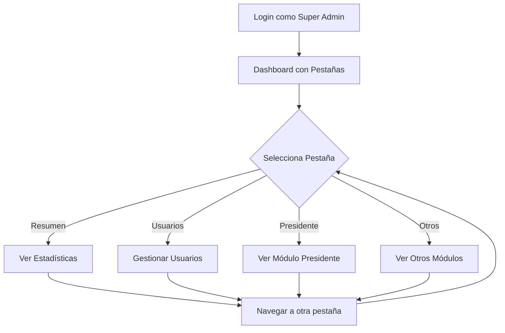

# 🎨 Vista Previa del Sistema de Pestañas - Super Administrador

## 📸 Cómo se verá tu nuevo dashboard

### 1. Header Principal
```
┌────────────────────────────────────────────────────────────────────┐
│  👑 Panel de Administración                    [Rodrigo Palma] [R] │
│  Bienvenido al panel de control del Super Admin                    │
│  📅 10/11/2025  🕐 03:55                                           │
└────────────────────────────────────────────────────────────────────┘
```

### 2. Barra de Pestañas (Navegación)
```
┌────────────────────────────────────────────────────────────────────┐
│ [📊 Resumen] [👥 Usuarios] [👔 Presidente] [🎩 Vicepresidente]     │
│ [💰 Tesorero] [📝 Secretaría] [📅 Vocero] [🎓 Socios]             │
└────────────────────────────────────────────────────────────────────┘
```

### 3. Contenido de cada Pestaña

#### 📊 PESTAÑA: RESUMEN
Tu dashboard actual con todas las estadísticas:
```
┌─────────────────────────────────────────────────────────────┐
│ Estadísticas de Usuarios                                     │
├─────────────┬─────────────┬─────────────┬─────────────────┤
│ TOTAL: 11   │ VERIF: 3    │ PEND: 8     │ NUEVOS MES: 4   │
│ 7 roles     │ 27.3%       │ ⚠️          │ 📅 Nov 2025     │
└─────────────┴─────────────┴─────────────┴─────────────────┘

┌─────────────────────────────────────────────────────────────┐
│ Actividad del Sistema                                        │
├─────────────┬─────────────┬─────────────┬─────────────────┤
│ EVENTOS: 9  │ LOGINS: 4   │ ERRORES: 0  │ TOTAL: 390      │
│ Últimas 24h │ Exitosos    │ Sin prob.   │ Historial       │
└─────────────┴─────────────┴─────────────┴─────────────────┘

┌─────────────────────────────────────────────────────────────┐
│ Distribución por Rol                                         │
├─────────────────────────────────────────────────────────────┤
│ Super Admin     ████████████░░░░░░░░░░  2    18.2%          │
│ Presidente      █████░░░░░░░░░░░░░░░░░  1     9.1%          │
│ Vicepresidente  █████░░░░░░░░░░░░░░░░░  1     9.1%          │
│ Tesorero        ████████████░░░░░░░░░░  2    18.2%          │
│ Secretario      █████░░░░░░░░░░░░░░░░░  1     9.1%          │
│ Vocero          ████████████░░░░░░░░░░  2    18.2%          │
│ Aspirante       ████████████░░░░░░░░░░  2    18.2%          │
└─────────────────────────────────────────────────────────────┘
```

#### 👥 PESTAÑA: USUARIOS
```
┌─────────────────────────────────────────────────────────────┐
│ 👥 Gestión de Usuarios                                       │
├─────────────────────────────────────────────────────────────┤
│                                                               │
│ [📋 Ver Usuarios] [➕ Crear Usuario] [🔒 Bloqueados]        │
│                                                               │
│ ┌─────────────────────────────────────────────────────────┐ │
│ │                                                           │ │
│ │     [IFRAME: Listado completo de usuarios]               │ │
│ │                                                           │ │
│ └─────────────────────────────────────────────────────────┘ │
└─────────────────────────────────────────────────────────────┘
```

#### 👔 PESTAÑA: PRESIDENTE
```
┌─────────────────────────────────────────────────────────────┐
│ 👔 Módulo de Presidente                                      │
├─────────────────────────────────────────────────────────────┤
│                                                               │
│ [📊 Dashboard] [📄 Cartas] [💼 Patrocinios] [📁 Proyectos]  │
│                                                               │
│ ┌─────────────────────────────────────────────────────────┐ │
│ │                                                           │ │
│ │     [IFRAME: Dashboard del Presidente]                   │ │
│ │                                                           │ │
│ └─────────────────────────────────────────────────────────┘ │
└─────────────────────────────────────────────────────────────┘
```

## 🎯 Características Principales

### ✨ Navegación
- ✅ Cambio de pestañas SIN recargar página (Alpine.js)
- ✅ Transiciones suaves entre pestañas
- ✅ Scroll horizontal en pantallas pequeñas
- ✅ Pestaña activa destacada con gradiente

### 🎨 Diseño
- ✅ Gradientes modernos (rojo → rosa → morado)
- ✅ Iconos emoji para fácil identificación
- ✅ Cards con hover effects
- ✅ Responsive design (móvil, tablet, desktop)

### 🔧 Funcionalidad
- ✅ Acceso a TODOS los módulos desde un solo lugar
- ✅ Mantiene permisos y seguridad existentes
- ✅ Estadísticas en tiempo real
- ✅ Accesos directos a funciones principales

### 📱 Responsive
```
Desktop (>1024px)     Tablet (768-1024px)    Móvil (<768px)
┌───────────────┐     ┌─────────────┐        ┌─────────┐
│ [Tab][Tab]... │     │ [Tab][Tab]  │        │ ←[Tab]→ │
│               │     │             │        │         │
│   CONTENIDO   │     │  CONTENIDO  │        │CONTENIDO│
│               │     │             │        │         │
└───────────────┘     └─────────────┘        └─────────┘
```

## 🚀 Ventajas del Sistema

### Para el Super Admin:
1. **Vista Única**: Todo en un solo lugar, no necesita cambiar de URL
2. **Navegación Rápida**: Un clic para acceder a cualquier módulo
3. **Contexto Completo**: Ve estadísticas y accede a funciones simultáneamente
4. **Eficiencia**: Reduce tiempo de navegación entre módulos

### Técnicas:
1. **Sin Recargas**: Usa Alpine.js para cambios instantáneos
2. **Modular**: Cada módulo mantiene su independencia
3. **Seguro**: Respeta los permisos y middlewares existentes
4. **Mantenible**: Fácil agregar o quitar pestañas

## 🎮 Interactividad

### Efectos Visuales:
- **Hover en Cards**: Scale 105% + sombra aumentada
- **Pestañas**: Gradiente en activa, gris en inactivas
- **Botones**: Transiciones suaves de color
- **Gráficas**: Barras de progreso animadas

### Atajos de Teclado (Opcional - para implementar después):
```
Alt + 1 → Pestaña Resumen
Alt + 2 → Pestaña Usuarios
Alt + 3 → Pestaña Presidente
... etc
```

## 📊 Flujo de Usuario



## 💡 Casos de Uso

### Escenario 1: Revisión Matutina
```
1. Super Admin inicia sesión
2. Ve dashboard con todas las estadísticas (Pestaña Resumen)
3. Nota 8 usuarios pendientes de verificación
4. Cambia a pestaña "Usuarios" (1 clic)
5. Verifica usuarios directamente
```

### Escenario 2: Gestión de Eventos
```
1. Super Admin necesita ver eventos
2. Cambia a pestaña "Vocero" (1 clic)
3. Ve calendario completo en iframe
4. Crea evento sin salir del dashboard
```

### Escenario 3: Auditoría Financiera
```
1. Super Admin revisa finanzas
2. Cambia a pestaña "Tesorero" (1 clic)
3. Ve reportes y transacciones
4. Exporta datos según necesite
```

## 🔮 Futuras Mejoras (Opcionales)

### Fase 2:
- [ ] Widgets arrastrables en Resumen
- [ ] Búsqueda global en todas las pestañas
- [ ] Modo oscuro/claro
- [ ] Notificaciones push en tiempo real

### Fase 3:
- [ ] Dashboard personalizable por usuario
- [ ] Atajos de teclado configurables
- [ ] Temas de color personalizados
- [ ] Exportar estadísticas a PDF/Excel

## 📖 Comparación: Antes vs Después

### ANTES:
```
Super Admin → Dashboard Admin → Solo estadísticas
Para ver usuarios: /admin/usuarios (nueva página)
Para ver presidente: /presidente/dashboard (nueva página)
Para ver tesorero: /tesorero/dashboard (nueva página)
...muchas navegaciones entre URLs
```

### DESPUÉS:
```
Super Admin → Dashboard con Pestañas → Todo accesible
Para ver usuarios: Clic en pestaña (mismo lugar)
Para ver presidente: Clic en pestaña (mismo lugar)
Para ver tesorero: Clic en pestaña (mismo lugar)
...todo desde una sola vista
```

## 🎯 Resumen Ejecutivo

**Tiempo de Implementación**: 15-30 minutos
**Beneficios Inmediatos**: Acceso centralizado a todos los módulos
**Experiencia de Usuario**: Mejora dramática en navegación
**Mantenimiento**: Bajo - código modular y bien documentado

---

¡Tu dashboard de Super Admin será la envidia de otros sistemas de gestión! 🚀
